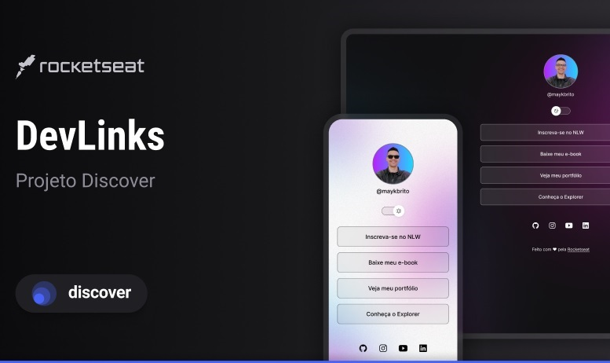

<h1 align="center"> Projeto-Discovery </h1>

  Programa esclusivo e gratuito, promovido pela Rocketseat para ensino de tecnologias WEB.

  <a href="#🚀-tecnologias">Tecnologias</a>&nbsp;&nbsp;&nbsp;&nbsp;
  <a href="#-projeto">Projeto</a>&nbsp;&nbsp;&nbsp;
  <a href="#-layout">Layout</a>&nbsp;&nbsp;&nbsp;
  <a href="#-memo-licença">Licença</a>&nbsp;&nbsp;&nbsp;

  

## 🚀 Tecnologias

Esse projeto foi desenvolvido durante a NLW da Rocketseat com as seguintes tecnologias:

- HTML e CSS
- JavaScript
- Git e Github
- Figma

## 🖥️ Projeto

O DevLinks é um agregador de Links para usar como Cartão de Visitas Online.

## 🏷️ Layout

Você pode visualizar o layout do projeto através
[desse link](<https://www.figma.com/file/F7fQ9ILtOoy6cBUVQcbOIp/C%C3%A1psula-do-tempo-%E2%80%A2-Trilha-Explorer-(Community)?type=design&node-id=306-3&mode=design&t=dzt2bhkkNIqhbVNk-0>). É necessário ter uma conta no [Figma](https://www.figma.com)

## :memo: Licença

Esse projeto está sob a licença MIT.

Feito com 💜 by Rocketseat :wave: [Participe da nossa comunidade!]
(https://discord.gg/rocketseat)
